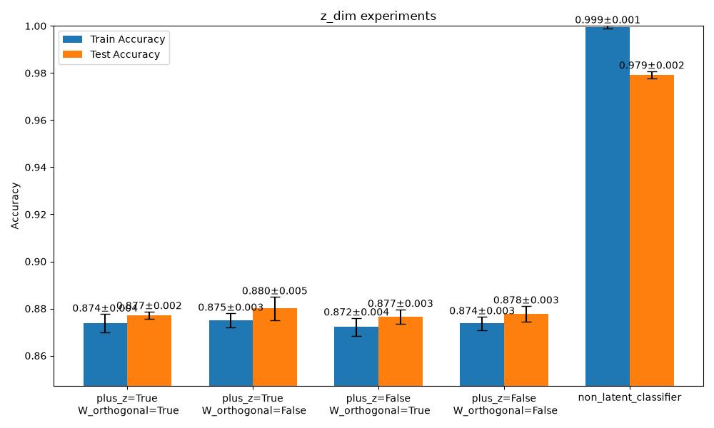
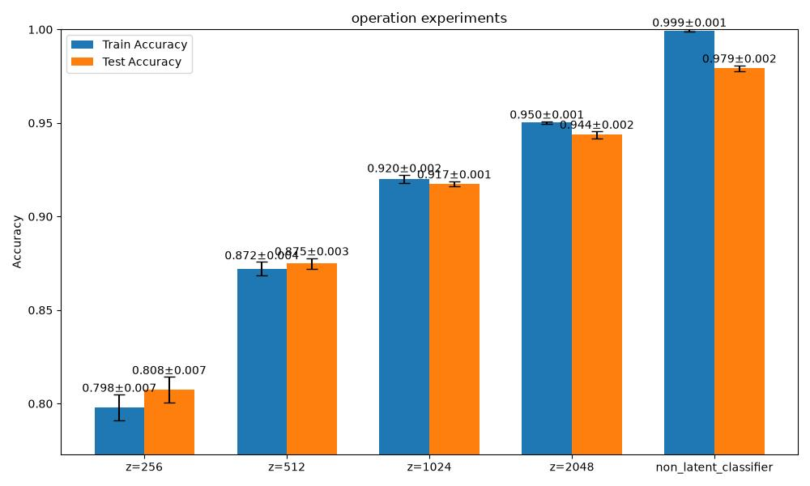

## Discussion

This project is a partial reproduction and experimental analysis of the paper:

> *[Paper Title]*
> https://arxiv.org/abs/2602.19134
> CVPR 2026 Best Paper Nominee

The experiments mainly investigate:

* the influence of latent dimension size (`z_dim`)
* the effect of using (W_n = W + z)
* the effect of orthogonal initialization on (W)

---

### Influence of `z_dim`

From the experimental results, increasing `z_dim` consistently improves classification accuracy.

In particular:

* `z_dim = 2048` achieves the best performance among the tested settings.
* Smaller latent dimensions lead to noticeably lower accuracy.

This suggests that larger latent dimensions may better approximate the intrinsic dimensionality of the original MLP parameter space.

In other words, increasing `z_dim` allows the latent parameterization to recover more expressive capacity from the original network.

---

### Influence of (W_n = W + z) and Orthogonal Initialization

The paper emphasizes two important design choices:

* using:

  [
  W_n = W + z
  ]

* applying orthogonal initialization to (W)

However, based on the current experiments, the differences between the four configurations:

* `is_plus_z=True/False`
* `is_W_orthogonal=True/False`

appear relatively small.

The observed accuracy variations are minor compared to the effect of changing `z_dim`.

Therefore, the practical importance of these two techniques remains somewhat unclear in this reproduction setting.

---

### Comparison with the Original MLP Baseline

All experiments were trained for:

* 100 epochs

Nevertheless, none of the tested latent models reached the accuracy of the original MLP baseline used as the control group.

This indicates that:

* the latent parameterization still introduces optimization difficulty,
* or the latent representation is unable to fully recover the original parameter manifold.

Possible reasons include:

* insufficient latent dimensionality,
* optimization instability,
* information bottlenecks introduced by the latent mapping,
* or differences between the reproduced implementation and the original paper setup.

Further experiments may be required to better understand these limitations.

## Project Structure

All experiment execution code is contained in:

* `exp_classifier.ipynb`

This notebook includes:

* training loops,
* evaluation procedures,
* repeated experiment runs,
* statistical analysis,
* results visualization.

All model implementations are contained in:

* `model.py`

This file includes:

* the baseline MLP classifier,
* latent-based classifier implementations,
* and the latent parameterization framework used in the experiments.

In addition, a `LatentConvVAE` implementation has also been completed for future experiments and further investigation of latent parameterized neural networks(MappingNetworks).

